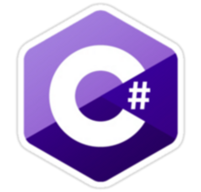

# Database from CollegeTestsProject

## Local Stack
**C#**

**PostgreSql**

## Branch Naming Convention

The **beginning** of the branch name is based on **technology**. For example:

+ If c# then: `cs-`...
+ If this is a **PostgreSql** script then: `sql-`...

Next, describe part the project. For example:

+ If this is a **testing-apps** then: `cs-testingapps`...
+ If this is a **initializing db** then: `sql-initializing`...

And then I have not think up :)
